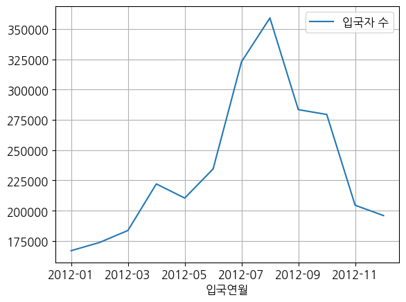
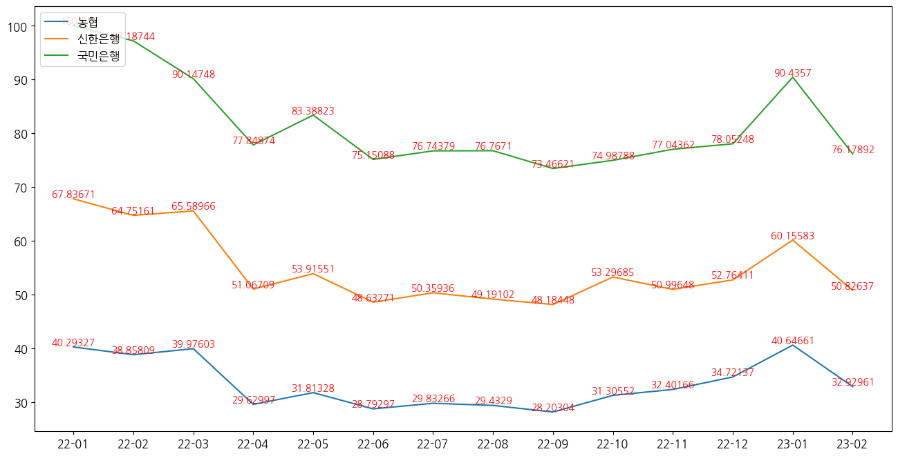

# colab_upload

# 사이드 프로젝트 : 크롤링 
- - - 

 * 1. 네이버 쇼핑 API를 통한 쇼핑 인사이트 
 * 2. 공공데이터 포털 API 파싱
   

   * 2-2. 한국문화관광연구원 _ 출입국관광통계서비스 내 중국인 출입 현황 그래프

       
* 3. 네이버 검색 트렌드 API를 통한 파싱
  * 3-1. 대한민국 3대 대형은행 (농협,신한,국민) 날짜별 검색 현황
  

  * 3-2. 쇼핑때와는 다르게 일률적으로 분포되어 있는 것을 확인
     
 - - - 
 
  
